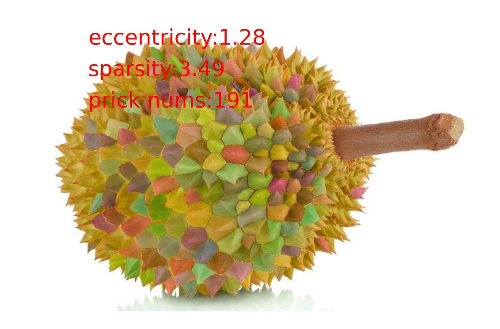

# Pick Your Durian 榴莲质量评估工具
榴莲品质评估工具是一个基于图像处理和计算几何特征的自动化解决方案，用于评估榴莲的品质。该工具使用图像分割技术（Segment-Anything）来对榴莲进行分割，然后计算其离心率和相对密度，以评估榴莲的形状和刺的密度。
<div>
    
    
</div>

## 功能
* 自动分割榴莲图像
* 计算榴莲的离心率以评估其圆度
* 计算榴莲刺的相对密度以评估其稀疏程度
* 综合评估榴莲品质

## 快速开始

### 安装依赖
1. 安装segment anything
```
pip install git+https://github.com/facebookresearch/segment-anything.git
```
2. 安装其他依赖
```
pip install opencv-python pycocotools matplotlib onnxruntime onnx
```
3. 下载模型放在项目根目录
```
wget https://dl.fbaipublicfiles.com/segment_anything/sam_vit_h_4b8939.pth
```

### 运行
``` Python
# Figure_Path 是要检测的图片路径
# Save_Path 是检测结果保存路径
# 示例 
# python detect.py --source 1.jpg --target r1.jpg 

python detect.py --source Figure_Path --target Save_Path

# 榴莲圆度： 1.28
# 榴莲刺稀疏度： 3.49
# 综合评分： 4.77
```

## TO DO List
由于缺少优质榴莲的数据集，所以还不能从指标直接给出是否是好榴莲的结论，只能根据评分相对的比较
- [x] 榴莲图像分割
- [x] 离心率和稀疏度计算
- [ ] 评估刺的形状是不是奶油尖尖
- [ ] 直接给出是否是优质榴莲的结论


